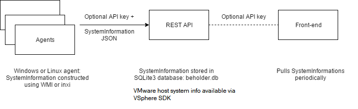
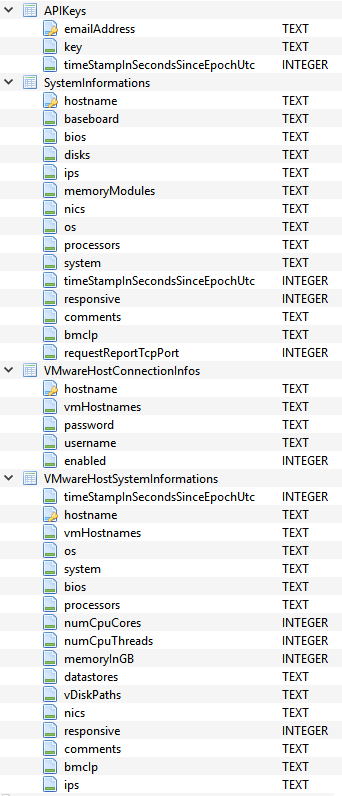

# sizingservers.beholder.dnfapi
*MIT Licensed   
<a href="https://www.sizingservers.be" target="_blank">Sizing Servers Research Lab</a> at <a href="https://www.howest.be" target="_blank">University College of West-Flanders, Department GKG</a>  
Dev: <a href="https://about.me/didjeeh" target="_blank">Dieter Vandroemme</a>*

## Table of contents
1. [Introduction](#introduction)
2. [Version history](#version_history)
3. [Languages, libraries, tools, technologies used and overview](#languages)
4. [Overview of the API](#overview)
5. [Build, publish and run](#build)
6. [Configure](#configure)
7. [Contribute](#contribute)
 

## Introduction

This project is part of a computer hardware inventorization solution, together with sizingservers.beholder.agent and sizingservers.beholder.frontend.

Agents are installed on the computers you want to inventorize. These communicate with the REST API which stores hardware info. The front-end app visualizes that info.

## Version history
**2018-07-12** - **version 0.2**: Added vhost host name and IP discovery.  
*Compatible with sizingservers.beholder.agent 0.1 / sizingservers.beholder.frontend 0.2*

    IMPORTANT - Added hostname and ip discovery to VHosts
    
    When upgrading from version 0.1, you must alter beholder.db for this to work:
    * add a TEXT field ips to VMwareHostSystemInformations
    * change ipOrHostname to hostname in VMwareHostSystemInformations and VMwareHostConnectionInfos 

**Previous versions**:
2018-06-22 - version 0.1: First robust implementation. Compatible with sizingservers.beholder.agent 0.1 / sizingservers.beholder.frontend 0.1

## Languages, libraries, tools and technologies used
The API is a **C# ASP.NET Web API 2 Application** (**.NET Framework 4.5**) contained within a **Visual Studio 2017** solution.  
Furthermore, the system information agents send gets stored in a **SQLite3** database: beholder.db.
The **VMware VSphere SDK 6.7** allows fetching VMware host system information.

The Windows' **IIS** web server is used in the testing and production infrastructure at Sizing Servers Lab. 

## Overview of the API
Communication happens over HTTP, using following structured url:

    http://< insert ip / fqdn here >:< port>/systeminformations/< call >?< params >

or

    http://< insert ip / fqdn here >:< port>/vmwarehosts/< call >?< params >

The **SystemInformationsController** class handles most communication and following calls are available:
  
* GET List, params apiKey  
  Returns all stored system informations.
  
  More on the API key later.
  
  Example: *GET http://localhost:5000/systeminformations/list?apiKey=...*
  
* POST Report, params apiKey, body systemInformation  
  To store a new system information in the database or replace an existing one using the hostname.
  
  System information has a model you can find in the solution. It should be serialized as JSON in the body of the call.
  
  Example: *POST http://localhost:5000/systeminformations/report?apiKey=...*
  
* DELETE Remove, params apiKey hostname  
  Removes the system information having the given hostname, if any.
  
* PUT CleanOlderThan, params days apiKey  
  Cleans up old system informations so the database represents reality.

  Example: *PUT http://localhost:5000/systeminformations/cleanolderthan?days=1&apiKey=...*
   
* PUT Clear, params apiKey  
  Clear all system informations in the database.

  Example: *PUT http://localhost:5000/systeminformations/clear?apiKey=..*.

The **VMwareHostsController** has following available:

* GET List, params apiKey  
  Returns all stored host connection informations.
  
  More on the API key later.
  
  Example: *GET http://localhost:5000/vmwarehosts/list?apiKey=...*
  
  * GET ListSystemInformation, params apiKey  
  Returns system info for all stored host connection informations.
    
  Example: *GET http://localhost:5000/vmwarehosts/listsysteminformation?apiKey=...*
  
* POST AddOrUpdate, params apiKey, body vmwareHostConnectionInfo  
  To store a new system information in the database or replace an existing one using the IP or hostname.
  
  System information has a model you can find in the solution. It should be serialized as JSON in the body of the call.
  
  Example: *POST http://localhost:5000/vmwarehosts/addorupdate?apiKey=...*
  
* DELETE Remove, params apiKey hostname  
  Removes the connection info having the given hostname, if any.
  
* PUT Clear, params apiKey  
  Clear all host connection infos in the database.

  Example: *PUT http://localhost:5000/vmwarehosts/clear?apiKey=..*.
  
Furthermore, check the XML documentation in the Build / comments in the code.

For all tables in the database models and data accessors are available.

## Build, publish and run
Publish to **IIS** using Visual Studio or host a pre-published version, see the 

* PublishedDebug
* PublishedRelease

folder.

To check if it works you can use a tool like Postman. Check the models in the Visual Studio solution to see how JSON payloads should be structured.

## Configure

### App_Data\\appsettings.json
    // For authorization an API key can be sent in the GET data (?apikey=<insert here>). API keys are stored in the database.
    // "Authorization": true is ignored for Debug builds (PublishedDebug folder).
    {
      "Authorization": true,
      "CacheExpiresInSeconds": 10,
      "PollIntervalInSeconds": 360
    }
    
Set Authorization to enable or disable the requirement of an API key for communication from agents to the API.

Only for a Release build, this setting is used. For a Debug build, communication always works without a key.

P.S.: This security measure is a bit silly and should be replaced by something better if you need it. If not, leave it as is.

Expireable cache is in place, so the database is not hammered too much each time system information is reported.

System information is not only reported automatically by the agents, but also by request:

* PollIntervalInSeconds is the interval that the API requests information from the agents and fetches it from the VSphere SDK.
* The frontend requests system information from the API. The default 10 second cache expires windows should be tight enough to always have the latest data on the web page.

### App_Data\\beholder.db
beholder.db contains four usable tables:

In APIKeys you can add keys manually, using SQLiteStudio. A key can be anything, for instance a SHA-512.  
SystemInformations is populated automatically by the use of the API.

System information exists for VMs / physical machines /vhosts. The timestamp is set when SystemInformation is added to / updated in the database.

vhosts need connection info.

## Contribute
Feel free to post issues and/or fork and submit pull requests. 